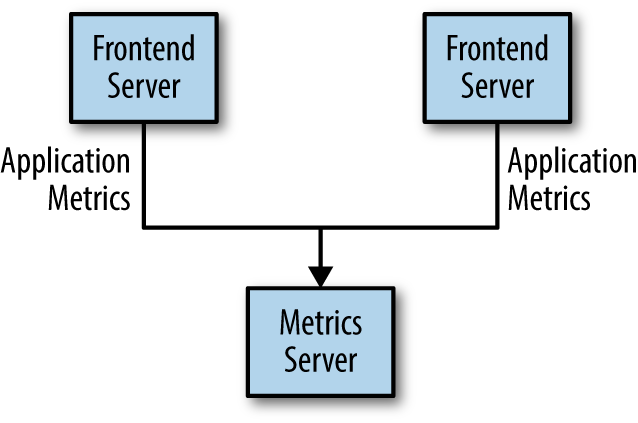
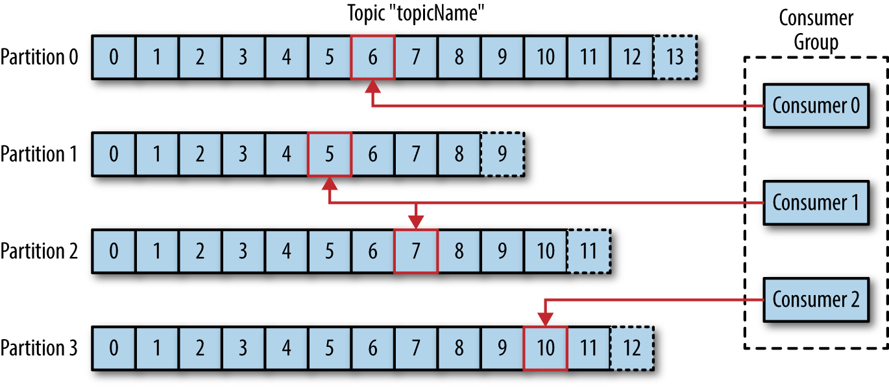

### Kafka's origin

*"I thought that since Kafka was a system optimized for writing, using a writer’s name would make sense.
I had taken a lot of lit classes in college and liked Franz Kafka. Plus the name sounded cool for an open source project.
So basically there is not much of a relationship."*
*Jay Kreps*

### Notion of pub/sub

Every byte of data has a story to tell, something of importance that will inform the next thing to be done. In order to know what that is, we need to get the data from where it is created to where it can be analyzed.

Publish/subscribe messaging is a pattern that is characterized by the sender (publisher) of a piece of data (message) not specifically directing it to a receiver. Instead, the publisher classifies the message somehow, and that receiver (subscriber) subscribes to receive certain classes of messages. Pub/sub systems often have a broker, a central point where messages are published, to facilitate this.

### How it starts

A simple message queue or interprocess communication channel

Many metrics publishers, using direct connections

The technical debt built up here is obvious, so you decide to pay some of it back. You set up a single application that receives metrics from all the applications out there, and provide a server to query those metrics for any system that needs them

### Goals set at Linkedin 

* Decouple producers and consumers by using a push-pull model

* Provide persistence for message data within the messaging system to allow multiple consumers

* Optimize for high throughput of messages

* Allow for horizontal scaling of the system to grow as the data streams grew

### Use cases

* ACTIVITY TRACKING
* MESSAGING (context mapping/remote procedure calls)
* METRICS AND LOGGING
* COMMIT LOG (re-syncing mechanism)
* STREAM PROCESSING (vs batch processing)
* EVENT SOURCING
* STORAGE

### Why Kafka?

* Single entry point/API for multiple use cases 
* No need to deploy a zoo of different systems
* Different users can consume messages multiple times
* Disk-Based Retention
* Scalability is easy, just more brokers (scale as you go without learning new stuff)

### Messages and Batches 

The unit of data within Kafka is called a message. If you are approaching Kafka from a database background, you can think of this as similar to a row or a record. In a most basic way, messages is a k/v pair where key is optional. 
Batch - collection of messages.  

### Schemas 

* Impose a structure on a messages sent to kafka
* Any format goes that can be serialized to bytes by the producer and deserialized by consumer 
* Most popular - JSON, Avro(complex types)

### Producers and Consumers

### Brokers and Clusters 

### Multiple Clusters

### Broker Configuration 

* BROKER.ID -  integer identifier, must be unique within a single Kafka cluster.

* Port - The example configuration file starts Kafka with a listener on TCP port 9092. This can be set to any available port by changing the port configuration parameter.

* ZOOKEEPER.CONNECT - hostname:port/path where /path, an optional Zookeeper path to use as a chroot environment for the Kafka cluster. If it is omitted, the root path is used.

* LOG.DIRS - If more than one path is specified, the broker will store partitions on them in a “least-used” fashion with one partition’s log segments stored within the same path. Note that the broker will place a new partition in the path that has the least number of partitions currently stored in it, not the least amount of disk space used

* NUM.RECOVERY.THREADS.PER.DATA.DIR -  configurable pool of threads for handling log segments
    - When starting normally, to open each partition’s log segments
    - When starting after a failure, to check and truncate each partition’s log segments
    - When shutting down, to cleanly close log segments
    
When setting this parameter, remember that the number configured is per log directory specified with log.dirs. This means that if num.recovery.threads.per.data.dir is set to 8, and there are 3 paths specified in log.dirs, this is a total of 24 threads.

* AUTO.CREATE.TOPICS.ENABLE
    - When a producer starts writing messages to the topic
    - When a consumer starts reading messages from the topic
    - When any client requests metadata for the topic
    
* NUM.PARTITIONS
* LOG.RETENTION.MS - it is set to 168 hours, or one week. 
However, there are two other parameters allowed, log.retention.minutes and log.retention.ms.
Retention by time is performed by examining the last modified time (mtime) on each log segment file on disk.
Under normal cluster operations, this is the time that the log segment was closed, and represents the timestamp of the last message in the file.

* LOG.RETENTION.BYTES - per-partition 
* LOG.SEGMENT.BYTES - Once the log segment has reached the size specified by the log.segment.bytes parameter, which defaults to 1 GB, the log segment is closed and a new one is opened. Once a log segment has been closed, it can be considered for expiration.

* LOG.SEGMENT.MS - Kafka will close a log segment either when the size limit is reached or when the time limit is reached, whichever comes first. By default, there is no setting for log.segment.ms, which results in only closing log segments by size.

* MESSAGE.MAX.BYTES - 1000000, or 1 MB. A producer that tries to send a message larger than this will receive an error back from the broker, and the message will not be accepted.
    - The message size configured on the Kafka broker must be coordinated with the fetch.message.max.bytes configuration on consumer clients. If this value is smaller than message.max.bytes, then consumers that encounter larger messages will fail to fetch those messages, resulting in a situation where the consumer gets stuck and cannot proceed. The same rule applies to the replica.fetch.max.bytes configuration on the brokers when configured in a cluster.
