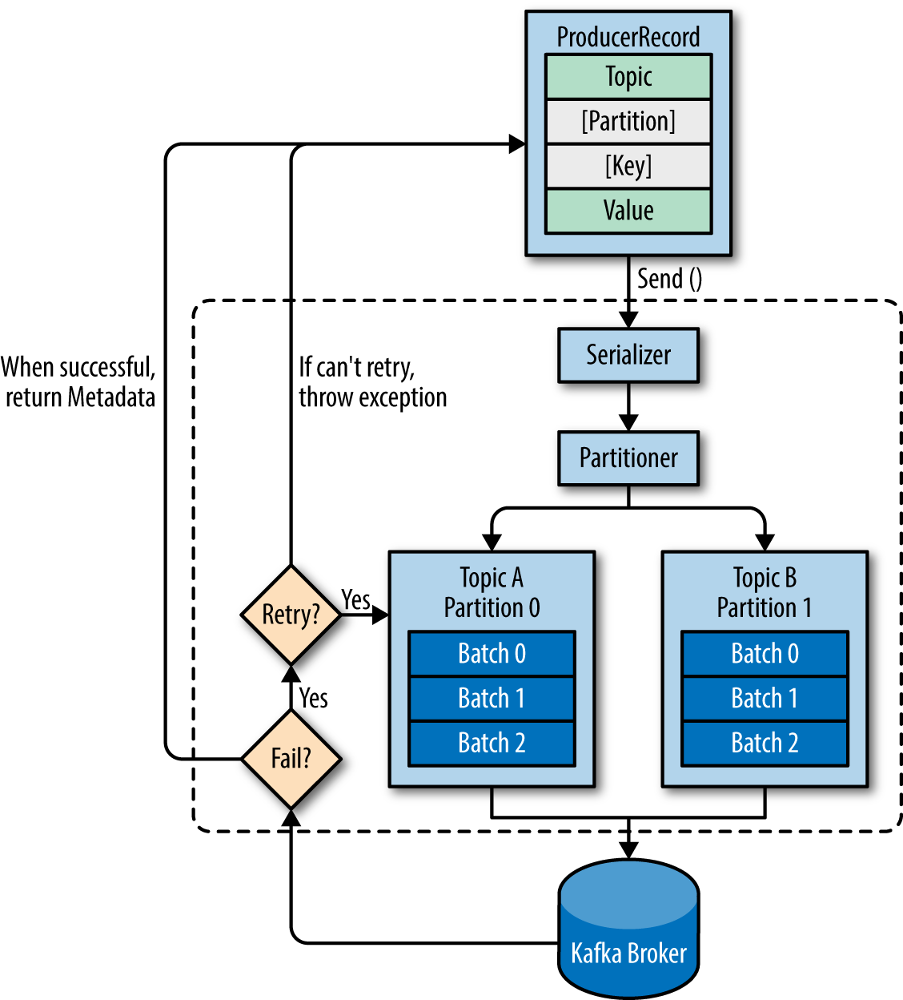
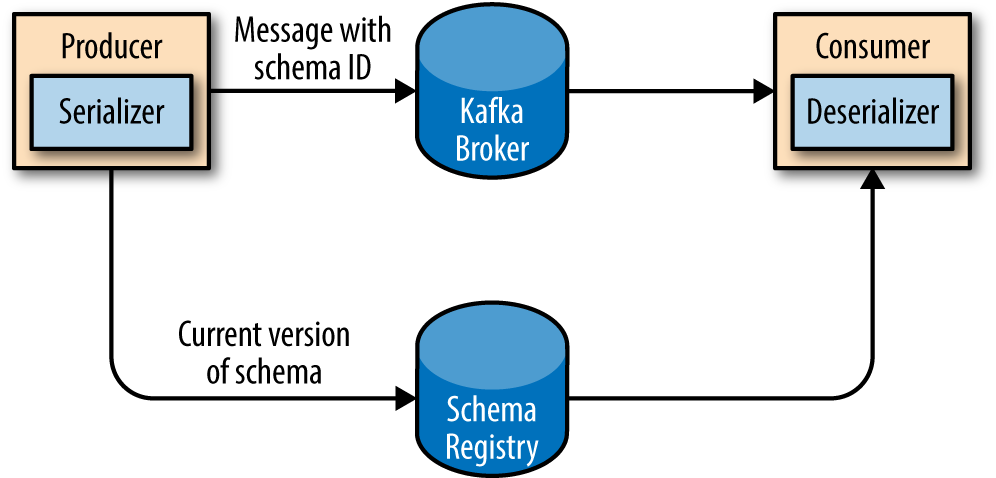

### Producer Overview

Diverse use cases also imply diverse requirements: is every message critical, or can we tolerate loss of messages? Are we OK with accidentally duplicating messages? Are there any strict latency or throughput requirements we need to support?



* We start producing messages to Kafka by creating a ProducerRecord, which must include the topic we want to send the record to and a value. 
Optionally, we can also specify a key and/or a partition. 
* Once we send the ProducerRecord, the first thing the producer will do is serialize the key and value objects to ByteArrays so they can be sent over the network.
* Next, the data is sent to a partitioner. If we specified a partition in the ProducerRecord, the partitioner doesn’t do anything and simply returns the partition we specified. If we didn’t, the partitioner will choose a partition for us, usually based on the ProducerRecord key. 
* Once a partition is selected, the producer knows which topic and partition the record will go to. It then adds the record to a batch of records that will also be sent to the same topic and partition. A separate thread is responsible for sending those batches of records to the appropriate Kafka brokers.
* When the broker receives the messages, it sends back a response. If the messages were successfully written to Kafka, it will return a RecordMetadata object with the topic, partition, and the offset of the record within the partition. If the broker failed to write the messages, it will return an error. When the producer receives an error, it may retry sending the message a few more times before giving up and returning an error


Producer sample 


```private Properties kafkaProps = new Properties(); 1
kafkaProps.put("bootstrap.servers", "broker1:9092,broker2:9092");

kafkaProps.put("key.serializer",
  "org.apache.kafka.common.serialization.StringSerializer"); 2
kafkaProps.put("value.serializer",
  "org.apache.kafka.common.serialization.StringSerializer");

producer = new KafkaProducer<String, String>(kafkaProps);
```

Kafka brokers expect byte arrays as keys and values of messages.
key.serializer + value.serializer ->  the producer will use this class to serialize the key and value object to a byte array.


Once we instantiate a producer, it is time to start sending messages. There are three primary methods of sending messages:

* Fire-and-forget
We send a message to the server and don’t really care if it arrives succesfully or not. Most of the time, it will arrive successfully, since Kafka is highly available and the producer will retry sending messages automatically. However, some messages will get lost using this method.

```buildoutcfg
ProducerRecord<String, String> record =
	new ProducerRecord<>("CustomerCountry", "Precision Products",
	  "France"); 
try {
  producer.send(record); 
} catch (Exception e) {
	e.printStackTrace(); 
}
```
The send() method returns a Java Future object with RecordMetadata, but since we simply ignore the returned value, we have no way of knowing whether the message was sent successfully or not. This method of sending messages can be used when dropping a message silently is acceptable.
While we ignore errors that may occur while sending messages to Kafka brokers or in the brokers themselves, we may still get an exception if the producer encountered errors before sending the message to Kafka.


* Synchronous send
We send a message, the send() method returns a Future object, and we use get() to wait on the future and see if the send() was successful or not.

```buildoutcfg
ProducerRecord<String, String> record =
	new ProducerRecord<>("CustomerCountry", "Precision Products", "France");
try {
	producer.send(record).get(); 
} catch (Exception e) {
		e.printStackTrace(); 
}
```

If there were any errors before sending data to Kafka, while sending, if the Kafka brokers returned a nonretriable exceptions or if we exhausted the available retries, we will encounter an exception. 

* Asynchronous send
We call the send() method with a callback function, which gets triggered when it receives a response from the Kafka broker.

```buildoutcfg
private class DemoProducerCallback implements Callback { 
	@Override
    public void onCompletion(RecordMetadata recordMetadata, Exception e) {
    	if (e != null) {
        	e.printStackTrace(); 
        }
    }
}

ProducerRecord<String, String> record =
	new ProducerRecord<>("CustomerCountry", "Biomedical Materials", "USA");
producer.send(record, new DemoProducerCallback()); 
```

If Kafka returned an error, onCompletion() will have a nonnull exception. Here we “handle” it by printing, but production code will probably have more robust error handling functions.

### Configuring Producers

* Acks - 0, 1 or all.
* BUFFER.MEMORY - the producer may run out of space and additional send() calls will either block or throw an exception, based on the block.on.buffer.full parameter
* COMPRESSION.TYPE - This parameter can be set to snappy, gzip, or lz4, in which case the corresponding compression algorithms will be used to compress the data before sending it to the brokers.
* RETRIES - By default, the producer will wait 100ms between retries, but you can control this using the retry.backoff.ms parameter.
* BATCH.SIZE - When multiple records are sent to the same partition, the producer will batch them together. This parameter controls the amount of memory in bytes (not messages!) that will be used for each batch. When the batch is full, all the messages in the batch will be sent. However, this does not mean that the producer will wait for the batch to become full.
* LINGER.MS - linger.ms controls the amount of time to wait for additional messages before sending the current batch. KafkaProducer sends a batch of messages either when the current batch is full or when the linger.ms limit is reached. 
* CLIENT.ID  - This can be any string, and will be used by the brokers to identify messages sent from the client. It is used in logging and metrics, and for quotas.
* MAX.IN.FLIGHT.REQUESTS.PER.CONNECTION  - This controls how many messages the producer will send to the server without receiving responses
Setting this to 1 will guarantee that messages will be written to the broker in the order in which they were sent, even when retries occur.
* TIMEOUT.MS, REQUEST.TIMEOUT.MS, AND METADATA.FETCH.TIMEOUT.MS - These parameters control how long the producer will wait for a reply from the server when sending data (request.timeout.ms) and when requesting metadata such as the current leaders for the partitions we are writing to (metadata.fetch.timeout.ms). If the timeout is reached without reply, the producer will either retry sending or respond with an error (either through exception or the send callback). timeout.ms controls the time the broker will wait for in-sync replicas to acknowledge the message in order to meet the acks configuration—the broker will return an error if the time elapses without the necessary acknowledgments.
* MAX.REQUEST.SIZE - It caps both the size of the largest message that can be sent and the number of messages that the producer can send in one request.
In addition, the broker has its own limit on the size of the largest message it will accept (message.max.bytes). It is usually a good idea to have these configurations match


### Using Avro Records with Kafka 

Apache Avro is a language-neutral data serialization format. The project was created by Doug Cutting to provide a way to share data files with a large audience.

Avro data is described in a language-independent schema. The schema is usually described in JSON and the serialization is usually to binary files, although serializing to JSON is also supported.

When the application that is writing messages switches to a new schema, the applications reading the data can continue processing messages without requiring any change or update.

### Schema registry 

The idea is to store all the schemas used to write data to Kafka in the registry. Then we simply store the identifier for the schema in the record we produce to Kafka. The consumers can then use the identifier to pull the record out of the schema registry and deserialize the data. The key is that all this work—storing the schema in the registry and pulling it up when required—is done in the serializers and deserializers. The code that produces data to Kafka simply uses the Avro serializer just like it would any other serializer

http://kafka-schema.cis.local:8081/subjects/salesforce_acc-value/versions/3




### Partitions

Keys serve two goals: they are additional information that gets stored with the message, and they are also used to decide which one of the topic partitions the message will be written to. All messages with the same key will go to the same partition.

When the key is null and the default partitioner is used, the record will be sent to one of the available partitions of the topic at random. A round-robin algorithm will be used to balance the messages among the partitions.

If a key exists and the default partitioner is used, Kafka will hash the key (using its own hash algorithm, so hash values will not change when Java is upgraded), and use the result to map the message to a specific partition.

