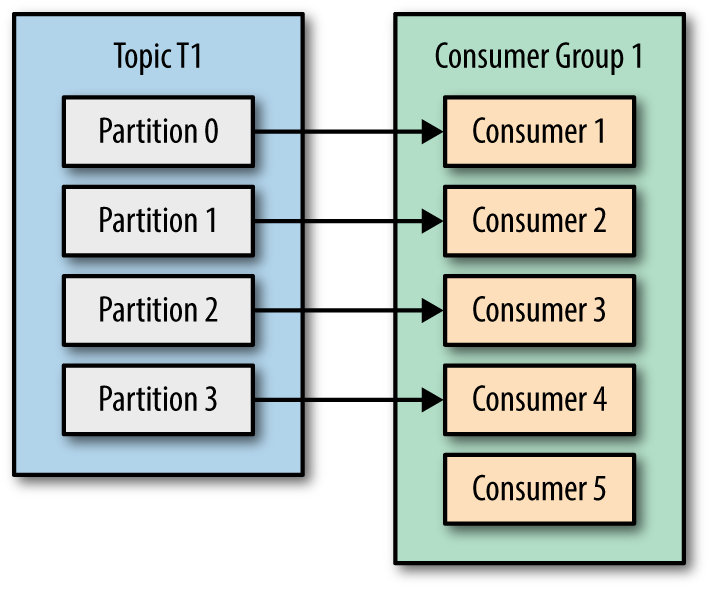

### Kafka Consumer API concepts.

Consumer object -> the need to scale consumption from topics.  Just like multiple producers can write to the same topic, we need to allow multiple consumers to read from the same topic, splitting the data between them.

Kafka consumers are typically part of a consumer group. When multiple consumers are subscribed to a topic and belong to the same consumer group, each consumer in the group will receive messages from a different subset of the partitions in the topic.




This is a good reason to create topics with a large number of partitions—it allows adding more consumers when the load increases. Keep in mind that there is no point in adding more consumers than you have partitions in a topic—some of the consumers will just be idle.

Separate consumer group for each application -> You add consumers to an existing consumer group to scale the reading and processing of messages from the topics, so each additional consumer in a group will only get a subset of the messages.


### Consumer Groups and Partition Rebalance

* When we add a new consumer to the group, it starts consuming messages from partitions previously consumed by another consumer. The same thing happens when a consumer shuts down or crashes; it leaves the group, and the partitions it used to consume will be consumed by one of the remaining consumers. Reassignment of partitions to consumers also happen when the topics the consumer group is consuming are modified (e.g., if an administrator adds new partitions).

* During a rebalance, consumers can’t consume messages, so a rebalance is basically a short window of unavailability of the entire consumer group. 

* The way consumers maintain membership in a consumer group and ownership of the partitions assigned to them is by sending heartbeats to a Kafka broker designated as the group coordinator (this broker can be different for different consumer groups). As long as the consumer is sending heartbeats at regular intervals, it is assumed to be alive, well, and processing messages from its partitions. Heartbeats are sent when the consumer polls (i.e., retrieves records) and when it commits records it has consumed.


* If the consumer stops sending heartbeats for long enough, its session will time out and the group coordinator will consider it dead and trigger a rebalance.  If a consumer crashed and stopped processing messages, it will take the group coordinator a few seconds without heartbeats to decide it is dead and trigger the rebalance. During those seconds, no messages will be processed from the partitions owned by the dead consumer. When closing a consumer cleanly, the consumer will notify the group coordinator that it is leaving, and the group coordinator will trigger a rebalance immediately, reducing the gap in processing. 

* In release 0.10.1, the Kafka community introduced a separate heartbeat thread that will send heartbeats in between polls as well. This allows you to separate the heartbeat frequency (and therefore how long it takes for the consumer group to detect that a consumer crashed and is no longer sending heartbeats) from the frequency of polling (which is determined by the time it takes to process the data returned from the brokers). With newer versions of Kafka, you can configure how long the application can go without polling before it will leave the group and trigger a rebalance. This configuration is used to prevent a livelock, where the application did not crash but fails to make progress for some reason. This configuration is separate from session.timeout.ms, which controls the time it takes to detect a consumer crash and stop sending heartbeats

* When a consumer wants to join a group, it sends a JoinGroup request to the group coordinator. The first consumer to join the group becomes the group leader. The leader receives a list of all consumers in the group from the group coordinator (this will include all consumers that sent a heartbeat recently and which are therefore considered alive) and is responsible for assigning a subset of partitions to each consumer. It uses an implementation of PartitionAssignor to decide which partitions should be handled by which consumer.

* After deciding on the partition assignment, the consumer leader sends the list of assignments to the GroupCoordinator, which sends this information to all the consumers. Each consumer only sees his own assignment—the leader is the only client process that has the full list of consumers in the group and their assignments. 

### Kafka Consumer

```
Properties props = new Properties();
props.put("bootstrap.servers", "broker1:9092,broker2:9092");
props.put("group.id", "CountryCounter");
props.put("key.deserializer",
  "org.apache.kafka.common.serialization.StringDeserializer");
props.put("value.deserializer",
  "org.apache.kafka.common.serialization.StringDeserializer");

KafkaConsumer<String, String> consumer = new KafkaConsumer<String, String>(props);
consumer.subscribe(Collections.singletonList("customerCountries"));
```

It is also possible to call subscribe with a regular expression. The expression can match multiple topic names, and if someone creates a new topic with a name that matches, a rebalance will happen almost immediately and the consumers will start consuming from the new topic.

### The poll loop 

At the heart of the consumer API is a simple loop for polling the server for more data. Once the consumer subscribes to topics, the poll loop handles all details of coordination, partition rebalances, heartbeats, and data fetching, leaving the developer with a clean API that simply returns available data from the assigned partitions.

```
try {
  while (true) { 1
      ConsumerRecords<String, String> records = consumer.poll(100); 2
      for (ConsumerRecord<String, String> record : records) 3
      {
          log.debug("topic = %s, partition = %s, offset = %d,
             customer = %s, country = %s\n",
             record.topic(), record.partition(), record.offset(),
             record.key(), record.value());

          int updatedCount = 1;
          if (custCountryMap.countainsValue(record.value())) {
              updatedCount = custCountryMap.get(record.value()) + 1;
          }
          custCountryMap.put(record.value(), updatedCount)

          JSONObject json = new JSONObject(custCountryMap);
          System.out.println(json.toString(4)) 4
      }
  }
} finally {
  consumer.close(); 5
}
```


